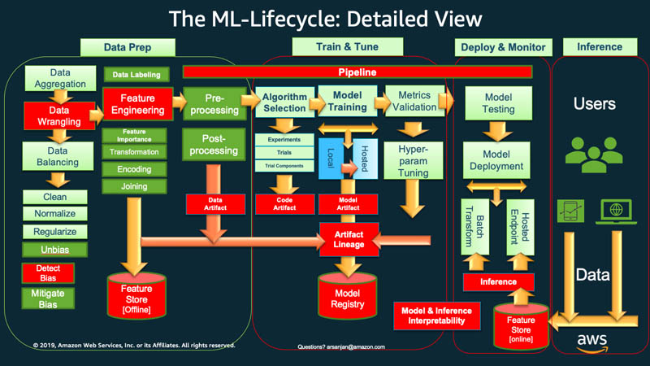
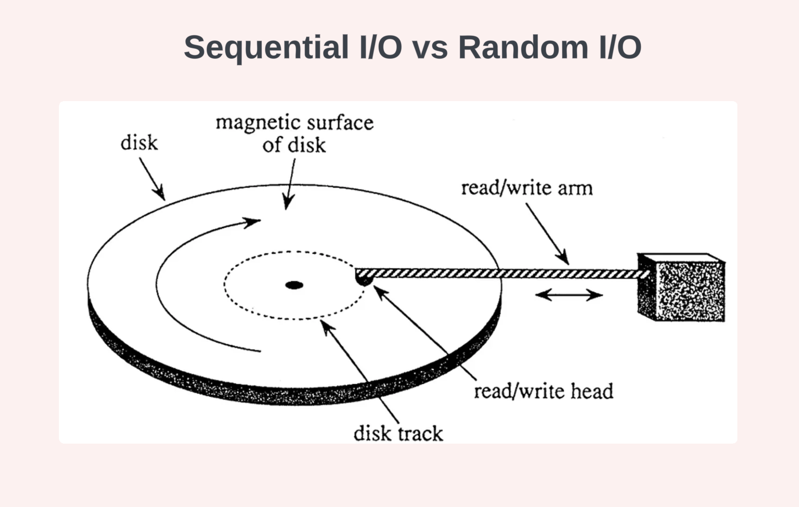
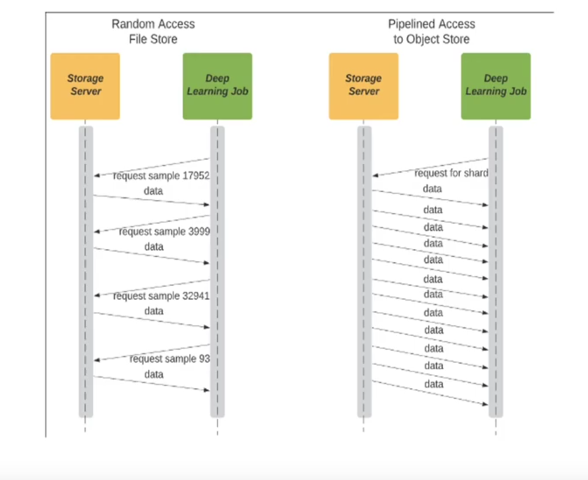

- [What is the task?](#org7e78ab8)
- [State of the Art](#org61da270)
- [Achievements](#org20c9933)
- [Results - Benchmarks](#orgb4ac006)
- [✨ Future work](#org21aea45)
- [Conclusions](#org8bdc263)


<a id="org7e78ab8"></a>

# What is the task?

Load training dataset stored in an S3 bucket to an EC2 machine ready for training.


## Why?

-   EBS storage is not cheap for constant storage. ([Fsx is even worse](https://calculator.aws/#/estimate?id=023d329247d598b57a1c00bb64ea8355148bd95c), currently [~1000$](https://us-east-1.console.aws.amazon.com/costmanagement/home?region=us-east-1#/home) per month)
-   [S3 downloading costs are cheap](https://aws.amazon.com/s3/pricing/). Max 40\*4\*4\*(0.023+0.09)$ = 72.32$ per month
    -   Max size of training dataset is ~40GB
        -   **spoiler** *this proposal will decrease it to 3-10GB*
    -   Max parallel instances training can be around 4 (currently)
    -   Max trainings per instance per month ~4
-   Standarization of our train pipelines to keep up with others


## ML Lifecycle




## Data preparation environment

Requirements:

-   Dataset easy manipulation and modification (**polars**, **pandas**, &#x2026;) for:
    -   Data aggregation
    -   Data balancing
    -   Data cleaning/normalization/regularization
    -   Data labeling
-   Dataset proper storage (**DVC**, **AWS tools**, **polars**)
-   Pipeline creation (**DVC**, **Dagger**, **Airflow**, &#x2026;)
-   Dataset versioning (**DVC**, &#x2026;)


## Training infra

Requirements:

-   Experiment tracking (**SageMaker**, **MLFlow**)
-   Dataset versioning (**DVC**,)
-   Data ingestion (**AWS storage tools**, **polars**, &#x2026;)
-   Training environment (**uv**, **pytorch**, &#x2026;)


<a id="org61da270"></a>

# State of the Art


## Training datasets processing best practices


### E.g.: `train_21082019.txt`

| # samples | size (GB) | mean sample size (KB) | Usual training batch size (samples) | Usual training batch size (MB) |
|--------- |--------- |--------------------- |----------------------------------- |------------------------------ |
| 1180347   | 38.5      | ~32.61                | 32                                  | 1.04                           |


### Best practices for high performance datasets processing

-   Sequential I/O
-   Pipelining
-   Sharding
-   Parallelization
-   High-Throughput Data Formats
-   Dedicated Data Processing Workers

### Sequential I/O



Characteristics:

-   All samples are together in memory, as in one file
-   Already ordered in disk. Randomization occurs before dataset file creation

Performance difference:

-   10x faster on usual local storage
-   Allow simpler/faster network storage


### Pipelining




### Sharding

Split a huge dataset file in several sequential parts.

Main advantage: allow **parallelization**


## Common data engines comparison

Two main types

-   Single-node engines (scale-up)
-   Multi-node or distributed engines (scale-out)


### Single-node engines benchmarks

<https://pola.rs/posts/benchmarks/>


### Distributed engines

<https://docs.daft.ai/en/stable/benchmarks/#tpc-h-benchmarks>


### General Feature comparison

| Engine                                          | Query Optimizer | Multimodal    | Distributed | Arrow Backed    | Vectorized Execution Engine | Out-of-core |
|----------------------------------------------- |--------------- |------------- |----------- |--------------- |--------------------------- |----------- |
| [Daft](https://github.com/Eventual-Inc/Daft)    | Yes             | Yes           | Yes         | Yes             | Yes                         | Yes         |
| [Pandas](https://github.com/pandas-dev/pandas)  | No              | Python object | No          | optional >= 2.0 | Some(Numpy)                 | No          |
| [Polars](https://github.com/pola-rs/polars)     | Yes             | Python object | No          | Yes             | Yes                         | Yes         |
| [Modin](https://github.com/modin-project/modin) | Yes             | Python object | Yes         | No              | Some(Pandas)                | Yes         |
| [Ray Data](https://github.com/ray-project/ray)  | No              | Yes           | Yes         | Yes             | Some(PyArrow)               | Yes         |
| [PySpark](https://github.com/apache/spark)      | Yes             | No            | Yes         | Pandas UDF/IO   | Pandas UDF                  | Yes         |
| [Dask DF](https://github.com/dask/dask)         | No              | Python object | Yes         | No              | Some(Pandas)                | Yes         |


<a id="org20c9933"></a>

# Achievements


## Custom dataset preparation recipes

Developed scripts to prepare

-   WebDatasets
-   and efficient Parquet datasets.


### Parquet dataset preparation

-   Fast (~40GB to ~3GB in ~6min)
-   In parallel
-   Easy to configure

## Prepared datasets

Generated different type of datasets to test (see [here](https://eu-central-1.console.aws.amazon.com/s3/buckets/wiris-ml-datasets?region=eu-central-1&tab=objects)):

-   Several **parquet** datasets with different compression rates
-   Several **sharded parquet** datasets with different compression rates
-   A **WebDataset**


## Custom benchmark framework

Developed a benchmark framework

-   File Loader
-   Ubiquitous Dataset
-   Benchmark class


### fileLoader Abstraction

```python
class fileLoader(ABC):
  @abstractmethod
  def load(
      self, file_path: Path, *args, **kwargs
  ) -> IO | IOBase | ContextManager | pl.LazyFrame:
      pass
```


### fileLoader example for local files

```python
@dataclass
class FSFileLoader(fileLoader):
    def load(
        self, file_path: Path, mode: str = "r", encoding: Optional[str] = None
    ) -> IO:
        logging.info(f"Loading {file_path}...")
        return file_path.open(
            mode=mode,
            encoding=encoding,
        )
```


### fileLoader example for S3 parquet files

```python
@dataclass
class S3ParquetLoader(fileLoader):
    s3_bucket_name: str

    def load(
        self,
        file_path: Path,
        schema: Optional[Dict] = None,
        aws_region: str = "eu-central-1",
    ) -> pl.LazyFrame:
        logging.info(f"Loading {file_path}...")
        return pl.scan_parquet(
            f"s3://{self.s3_bucket_name}/{file_path}",
            schema=schema,
            storage_options={"aws_region": aws_region},
        )
```


### Ubiquitous Dataset Abstraction

Load a [custom Pytorch Dataset](https://docs.pytorch.org/tutorials/beginner/basics/data_tutorial.html#creating-a-custom-dataset-for-your-files) no matter where/how the samples are stored.

-   Just needs the length calculation and the `__iter__` functionality
-   Inherits pytorch Dataset class as parent so it's automatically compatible with pytorch

```python
from torch.utils.data import Dataset
import polars as pl

class UbiquitousDataset(Dataset):
    @abstractmethod
    def load_dataset(
        self, file_path: Path, *args, **kwargs
    ) -> List[List[str]] | pl.LazyFrame:
        pass

    @abstractmethod
    def length(self) -> int:
        pass

    @abstractmethod
    def get_item(self, idx) -> tuple[str, str]:
        pass

```


### S3ParquetDataset example

```python
class S3ParquetDataset(UbiquitousDataset):
  def __init__(
      self,
      s3_bucket_name: str,
      dataset_file_path: Path,
      _samples_dir_path: Optional[Path] = None,
  ) -> None:
      self.s3_bucket_name = s3_bucket_name
      self.file_loader: S3ParquetLoader = S3ParquetLoader(s3_bucket_name)
      self.dataset_file_path = dataset_file_path
      self._samples_dir_path = _samples_dir_path

      self.items: pl.DataFrame = self.load_parquet_dataset().collect(
          engine="streaming"
      )
      self.df_length: int = self.length()

  @property
  def samples_dir_path(self) -> Path:
      if self._samples_dir_path is None:
          return self.dataset_file_path.parent

      return self._samples_dir_path

  def __len__(self) -> int:
      return self.df_length

  def __getitem__(self, idx: int) -> tuple[str, str]:
      return self.get_item()

  def load_parquet_dataset(self) -> pl.LazyFrame:
      try:
          df = self.file_loader.load(
              self.dataset_file_path,
              schema={
                  "sample_path": pl.String,
                  "label": pl.String,
                  "sample": pl.List(pl.List(pl.List(pl.Float64))),
              },
          ).select(pl.col("sample"), pl.col("label"))

          return df
      except Exception as e:
          logging.error(e)
          raise e

  def load_dataset(self, *args, **kwargs) -> pl.LazyFrame:
      return self.load_parquet_dataset()

  def length(self) -> int:
      return self.items.select(pl.len()).item()

  def get_item(self) -> tuple[str, str]:
      return str(self.items["sample"][idx].to_list()), self.items["label"][idx]

```


### Benchmark class

-   Mock training (just iterating through samples using the Dataloader default way)
-   Timer

```python
def train_mock(self) -> float:
      t = Timer(name=f"{self.load_from}-{self.load_as}-train-mock")
      sum_t = 0
      for epoch in range(self.train_epochs):
          t.start()
          # for train_features, train_labels in tqdm(self.dataloader):
          for train_features, train_labels in tqdm(self.dataloader):
              pass
          sum_t += t.stop()
      mean_t = sum_t / self.train_epochs
      return mean_t
```


## Data Loading Solutions considered

-   Local - files dataset
-   S3 - files dataset
-   S3 - **WebDatasets**
-   Local - **polars LazyFrames** from **parquet** highly compressed
-   S3 - **polars LazyFrames** from **parquet** highly compressed


<a id="orgb4ac006"></a>

# Results - Benchmarks

-   Not real Training
-   All following benchmarks have been calculated from wiris old laptop
-   New laptop is only able to run polars parquet dataloaders


## Local - files dataset

-   No sequential I/O


### Results

| Size (Cloud storage) | Dataset creation time | Size (Local Disk) | Download time b4 training | Training (1 epoch) time |
|-------------------- |--------------------- |----------------- |------------------------- |----------------------- |
| ~40 GB               | 0s (already created)  | ~40 GB            | 15325.533 s               | 61.3527 s               |


## S3 - files dataset

-   No sequential I/O


### Results

&#x2026;

| Size (Cloud storage) | Dataset creation time | Size (Local Disk) | Download time b4 training | Training (1 epoch) time |
|-------------------- |--------------------- |----------------- |------------------------- |----------------------- |
| ~40 GB               | 0s (already created)  | 0 GB              | 0 s                       | 22223.2921 s            |


## S3 - [WebDatasets](https://github.com/webdataset/webdataset)

-   Sequential I/O
-   Pipelining
-   Sharding
-   Allows streaming and caching
-   Old
    -   Not supported by Pytorch anymore
    -   Not direct support to s3 buckets (needs a public url)
    -   [Issues](https://github.com/webdataset/webdataset/blob/main/ISSUES.md)

### Results

| Size (Cloud storage) | Dataset creation time | Size (Local Disk) | Download time b4 training | Training (1 epoch) time |
|-------------------- |--------------------- |----------------- |------------------------- |----------------------- |
| ~40 GB\*             | ?                     | 0 GB              | 0.0010 s ?                | ? s                     |

\*Tar compression may be improved

😢


## Local/S3 - [HF Datasets](https://github.com/huggingface/datasets)

-   Sequential I/O
-   Pipelining
-   Sharding
-   Allows streaming and caching
-   Lazy load
-   Based on Pandas internally
-   Focused on loading Datasets published in the HF Spaces


### Results

Do not finish loading the dataset dataframe. Breaks before.

😢


## Local - polars LazyFrames from parquet highly compressed

-   Sequential I/O
-   Pipelining and parallelization (`scan_async`)
-   Sharding
-   Avoid memory consummption that is not needed
-   Able to export to any type, even pil objects, numpy and tensors
-   Optimized loading and exporting functions to cloud storage
-   Can share workload with GPU


### Results

| Size (Cloud storage) | Dataset creation time | Size (Local Disk) | Download time b4 training | Training (1 epoch) time |
|-------------------- |--------------------- |----------------- |------------------------- |----------------------- |
| 3 GB                 | 22.6430 s             | 3 GB              | 309.793 s                 | 277.5 s                 |

😏


## S3 - polars LazyFrames from parquet highly compressed

-   Sequential I/O
-   Pipelining and parallelization (`scan_async`)
-   Sharding
-   Avoid memory consummption that is not needed
-   Able to export to any type, even pil objects, numpy and tensors
-   Optimized loading and exporting functions to cloud storage
-   Can share workload with GPU


### Results

| Size (Cloud storage) | Dataset creation time  | Size (Local Disk) | Download time b4 training | Training (1 epoch) time |
|-------------------- |---------------------- |----------------- |------------------------- |----------------------- |
| 3 GB                 | 403.6961 s             | 0 GB              | 0 s                       | 249.4792 s              |
|                      | 368.1926 s (streaming) |                   |                           |                         |

😏


<a id="org21aea45"></a>

# ✨ Future work

-   **Main**
    -   Push latest features to the repo
    -   Test with a real training
    -   Test in our current instances
    -   Improve memory consumption using Pytorch Iterable Datasets with a loader class for the async Polars solution to allow lazy Dataloading
    -   Evaluate the cost of downloading a dataset from S3 with every training

-   Others
    -   Benchmark Pandas (if HF is not enough)
    -   Benchmark Daft
    -   Finish the DVC layer
    -   Fix some memory issues (Local Parquet loader)


<a id="org8bdc263"></a>

# Conclusions

-   Parquet datasets
    -   follow data standards
    -   reduce dataset size
-   Data Loader abstractions
    -   seamless integration with PyTorch as they are
    -   clean approach to allow training with any kind of dataset type stored anywhere
-   Current best benchmark is the usual FSFileLoader approach
-   Polars
    -   best data engine for our case
    -   benchmarks can be improved using Iterable Datasets
