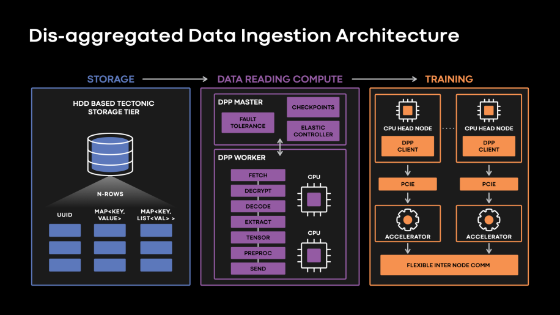

#+title: Dataset Load Benchmarks
#+EXCLUDE_TAGS: noexport
#+OPTIONS: broken-links:t num:0 toc:1 timestamp:nil

:REVEAL_PROPERTIES:
#+REVEAL_ROOT: https://cdn.jsdelivr.net/npm/reveal.js
#+REVEAL_VERSION: 4
#+REVEAL_TITLE_SLIDE: <h2>Data ingestion architecture</h2><h3>13-11-25</h3>
Dani - ML Team

# #+REVEAL_EXTRA_CSS: https://maxcdn.bootstrapcdn.com/font-awesome/4.5.0/css/font-awesome.min.css
# #+REVEAL_EXTRA_INITIAL_JS: transition: 'none'
#+REVEAL_EXTRA_CSS: custom-reveal.css
# #+REVEAL_EXTRA_JS: custom-reveal.js
#+REVEAL_HLEVEL: 2
#+REVEAL_PLUGINS: (highlight notes zoom)
#+REVEAL_THEME: night
#+REVEAL_TRANS: none
:END:

#+begin_comment
To export presentation to PDF add ~/?print-pdf~ at the end of the url of the page.
#+end_comment

* What is the task?

📝

#+begin_comment
Build the data reading compute part for a Data Ingestion Pipeline.

#+ATTR_HTML: :width 40% :height 40%

In other words:

#+end_comment

Load training dataset stored in an S3 bucket to an EC2 machine ready for training.

** 📝 Why?

#+ATTR_HTML: :class r-fit-text
#+ATTR_REVEAL: :frag (appear)
- EBS storage is not cheap for constant storage. ([[https://calculator.aws/#/estimate?id=023d329247d598b57a1c00bb64ea8355148bd95c][Fsx is even worse]], currently [[https://us-east-1.console.aws.amazon.com/costmanagement/home?region=us-east-1#/home][~1000$]] per month)
- [[https://aws.amazon.com/s3/pricing/][S3 downloading costs are cheap]]. Max 40*4*4*(0.023+0.09)$ = 72.32$ per month
  - Max size of training dataset is ~40GB
    - *spoiler* /this proposal will decrease it to 3-10GB/
  - Max parallel instances training can be around 4 (currently)
  - Max trainings per instance per month ~4
- Standarization of our train pipelines to keep up with others

#+begin_comment
Is it possible to create brand new EC2 instances, load the training dataset,
train and kill the machines?
#+end_comment

** 📝 ML Lifecycle

#+ATTR_HTML: :width 100% :height 40%
[[file:ML-Lifecycle-Detail.jpg]]

** 📝 Data preparation environment

Requirements:

#+ATTR_HTML: :class r-stretch :style font-size:25px;
#+ATTR_REVEAL: :frag (appear)
- Dataset easy manipulation and modification (*polars*, *pandas*, ...) for:
  - Data aggregation
  - Data balancing
  - Data cleaning/normalization/regularization
  - Data labeling
- Dataset proper storage (*DVC*, *AWS tools*, *polars*)
- Pipeline creation (*DVC*, *Dagger*, *Airflow*, ...)
- Dataset versioning (*DVC*, ...)

 #+begin_notes
- IMPORTANT: Datasets should be shared between all ML team. Any improvements
  should be considered by all of us
- This could help us organizing our tasks, too
#+end_notes

** 📝 Training infra

Requirements:

#+ATTR_REVEAL: :frag (appear)
- Experiment tracking (*SageMaker*, *MLFlow*)
- Dataset versioning (*DVC*,)
- Data ingestion (*AWS storage tools*, *polars*, ...)
- Training environment (*uv*, *pytorch*, ...)

** 📝 What is the challenge?                                        :noexport:

The solution should consider both training and data preparation requirements.

** 📝 Proposed infrastructure                                       :noexport:

* State of the Art

** Training datasets processing best practices

*** E.g.: ~train_21082019.txt~

#+ATTR_HTML: :class r-fit-text
| # samples | size (GB) | mean sample size (KB) | Usual training batch size (samples) | Usual training batch size (MB) |
|-----------+-----------+-----------------------+-------------------------------------+--------------------------------|
|   1180347 |      38.5 | ~32.61                |                                  32 |                           1.04 |

#+begin_notes
Calculations

# samples:

#+begin_src shell
wc -l ML/dataset-ec2-load-benchmarks/data/strokes/wiris-math-online-incomplete/train_21082019.txt
#+end_src

samples folders:

#+begin_src shell
grep -Eo '^[^[:space:]]+/' ML/dataset-ec2-load-benchmarks/data/strokes/wiris-math-online-incomplete/train_21082019.txt | sort -u
#+end_src

mean sample size:

du -h ~/ML/dataset-ec2-load-benchmarks/data/strokes/wiris-math-online-incomplete/samples-chemistry/
+
du -h ~/ML/dataset-ec2-load-benchmarks/data/strokes/wiris-math-online-incomplete/samples-editorfont/samples/
+
du -h ~/ML/dataset-ec2-load-benchmarks/data/strokes/wiris-math-online-incomplete/samples-generated-editor-stretchy-fixmatrix/
+
du -h ~/ML/dataset-ec2-load-benchmarks/data/strokes/wiris-math-online-incomplete/samples-mturk-split/
+
du -h ~/ML/dataset-ec2-load-benchmarks/data/strokes/wiris-math-online-incomplete/samples-multiline/
+
du -h ~/ML/dataset-ec2-load-benchmarks/data/strokes/wiris-math-online-incomplete/samples-split-and-replace-pr025-fixmatrix-fixmroot/

/ 1180347

= 46 MB + 497 MB + 5.7 GB + 6.9 GB + 343 MB + 25 GB / 1180347

= 38.5 GB / 1180347 = 32.61 KB
#+end_notes

*** Best practices for high performance datasets processing

#+ATTR_REVEAL: :frag (appear)
- Sequential I/O
- Pipelining
- Sharding
- Parallelization
- High-Throughput Data Formats
- Dedicated Data Processing Workers

#+begin_notes
- Ref: https://youtu.be/kNuA2wflygM?feature=shared&t=469
#+end_notes

*** Sequential I/O

#+ATTR_HTML: :width 40% :height 40%
[[file:sequential-io-intuition.png]]

Characteristics:

#+ATTR_REVEAL: :frag (appear)
- All samples are together in memory, as in one file
- Already ordered in disk. Randomization occurs before dataset file creation

*** Sequential I/O

#+ATTR_HTML: :width 40% :height 40%
[[file:sequential-io-intuition.png]]

Performance difference:

#+ATTR_REVEAL: :frag (appear)
- 10x faster on usual local storage
- Allow simpler/faster network storage

*** Pipelining

#+ATTR_HTML: :width 70% :height 40%
[[file:pipelining_example.png]]

*** Sharding

Split a huge dataset file in several sequential parts.

Main advantage: allow *parallelization*

*** Preferred format [[https://github.com/apache/parquet-format][Apache Parquet]]                                  :noexport:

#+ATTR_HTML: :class r-fit-text
#+ATTR_REVEAL: :frag (appear)
- column-oriented data file (ideal for *DataFrames*)
- *efficient* data *storage and retrieval*
- high performance *compression*
- encoding schemes to handle *complex data in bulk*
- *supported* in many programming languages and analytics tools

** g6.2xlarge EC2 hardware details                                  :noexport:

*** CPU

| # vCPU | Memory (GiB) |
|--------+--------------|
|      8 |           32 |

*** GPU

| # GPU | Model     | GPU Memory (GB) | GPU BW (GBps) | TFLOPS (FP32) |
|-------+-----------+-----------------+---------------+---------------|
|     1 | [[https://www.nvidia.com/en-us/data-center/l4/][NVIDIA L4]] |              24 |           300 |          30.3 |

*** Disk and connection speed

| Storage (GB) | Network BW (Gbps) | EBS BW (Gbps) |
|--------------+-------------------+---------------|
|          450 | Up to 10          | Up to 5       |

** Common data engines comparison

Two main types

#+ATTR_REVEAL: :frag (appear)
- Single-node engines (scale-up)
- Multi-node or distributed engines (scale-out)

*** Single-node engines benchmarks

https://pola.rs/posts/benchmarks/

*** Distributed engines

https://docs.daft.ai/en/stable/benchmarks/#tpc-h-benchmarks

*** General Feature comparison
#+ATTR_HTML: :class r-stretch :style font-size:20px;
| Engine   | Query Optimizer | Multimodal    | Distributed | Arrow Backed    | Vectorized Execution Engine | Out-of-core |
|----------+-----------------+---------------+-------------+-----------------+-----------------------------+-------------|
| [[https://github.com/Eventual-Inc/Daft][Daft]]     | Yes             | Yes           | Yes         | Yes             | Yes                         | Yes         |
| [[https://github.com/pandas-dev/pandas][Pandas]]   | No              | Python object | No          | optional >= 2.0 | Some(Numpy)                 | No          |
| [[https://github.com/pola-rs/polars][Polars]]   | Yes             | Python object | No          | Yes             | Yes                         | Yes         |
| [[https://github.com/modin-project/modin][Modin]]    | Yes             | Python object | Yes         | No              | Some(Pandas)                | Yes         |
| [[https://github.com/ray-project/ray][Ray Data]] | No              | Yes           | Yes         | Yes             | Some(PyArrow)               | Yes         |
| [[https://github.com/apache/spark][PySpark]]  | Yes             | No            | Yes         | Pandas UDF/IO   | Pandas UDF                  | Yes         |
| [[https://github.com/dask/dask][Dask DF]]  | No              | Python object | Yes         | No              | Some(Pandas)                | Yes         |

* Achievements
📖

** 📖 Custom dataset preparation recipes

Developed scripts to prepare

- WebDatasets
- and efficient Parquet datasets.

*** Parquet dataset preparation

#+ATTR_REVEAL: :frag (appear)
- Fast (~40GB to ~3GB in ~6min)
- In parallel
- Easy to configure

#+ATTR_REVEAL: :code_attribs data-line-numbers='|161-173|180-192'
#+begin_src python
from typing import List, Optional
import logging
from pathlib import Path
import multiprocessing

# from s3fs import S3FileSystem
import polars as pl
from tqdm import tqdm
import orjson as json

from src.file_loader import FSFileLoader
from src.timer import Timer

# logging.basicConfig(level=logging.DEBUG)

def load_data_annotation(
    data_annotation_file_path: Path,
    file_loader: FSFileLoader = FSFileLoader(),
    data_annotation_separator: str = " ",
) -> List[List[str]]:
    items = []
    paths = []
    labels = []
    try:
        with file_loader.load(
            data_annotation_file_path,
            mode="r",
            encoding="utf-8",
        ) as f:
            for i, line in enumerate(tqdm(f)):
                # TODO: Remove. Temporal exit for testing purposes
                # if i > 5000:
                #     return [paths, labels]

                path, label = f"{line}".split(data_annotation_separator, 1)

                paths.append(path)
                labels.append(label)
            items = [paths, labels]
        return items
    except Exception as e:
        logging.error(e)
        raise e

def load_sample(
    sample_path: str, file_loader: FSFileLoader = FSFileLoader()
) -> List[List[List[float]]]:
    # logging.debug(f"Sample path to load: {self.s3_bucket_name}{sample_path}")

    sample = []
    try:
        with file_loader.load(
            Path(sample_path),
            mode="r",
        ) as f:
            sample_file = f.read()
            if sample_file:
                sample = json.loads(sample_file)
        return sample
    except Exception as e:
        logging.error(f"Error loading {sample_path}")
        logging.error(e)
        raise e

@Timer(name="Dataset transformation to polars df as parquet file")
def strokes_data_annotation_to_df(
    items: List[List[str]],
    shard_i: int,
    dataset_file_path: Path,
    dataset_parquet_path: Path,
    s3_bucket_name: str,
    compression: pl._typing.ParquetCompression = "zstd",
    compression_level: Optional[int] = None,
    use_pyarrow: bool = False,
):
    train_df = (
        pl.DataFrame(items)
        .rename(
            {
                "column_0": "sample_path",
                "column_1": "label",
            }
        )
        .with_columns(
            pl.col("sample_path")
            .str.replace("^./", f"{dataset_file_path.parent}/")
            .map_elements(
                load_sample,
                # return_dtype=pl.List(pl.List(pl.List(pl.Float64))),
                return_dtype=pl.List(pl.List(pl.Array(pl.Float64, 2))),
            )
            # .map_elements(load_sample, return_dtype=pl.List)
            # .map_elements(load_sample, return_dtype=pl.List(pl.Float64))
            .alias("sample"),
        )
        .with_columns(pl.col("label").str.split(by=" "))
        .select(["sample", "label"])
    )

    print(f"sharded_train_df.head(): {train_df.head()}")
    logging.debug(f"sharded_train_df.head(): {train_df.head()}")
    logging.debug(f"sharded_train_df.tail(): {train_df.tail()}")
    logging.debug(train_df.collect_schema().names())

    # NOTE: Data preparation steps could be done here

    logging.info(f"data/{dataset_parquet_path}")
    train_df.write_parquet(
        Path(
            f"data/{dataset_parquet_path.stem}.{shard_i:04d}{dataset_parquet_path.suffix}"
        ),
        use_pyarrow=use_pyarrow,
        compression=compression,
        compression_level=compression_level,
    )
    logging.info(f"Writing s3://{s3_bucket_name}/{dataset_parquet_path}")
    train_df.write_parquet(
        f"s3://{s3_bucket_name}/{dataset_parquet_path.parent}/{dataset_parquet_path.stem}.{shard_i:04d}{dataset_parquet_path.suffix}",
        use_pyarrow=use_pyarrow,
        compression=compression,
        compression_level=compression_level,
        storage_options={"aws_region": "eu-central-1"},
    )
    logging.info(f"s3://{s3_bucket_name}/{dataset_parquet_path} file written")

@Timer(name="Dataset transformation to polars df as a set of sharded parquet files")
def mproc_strokes_dataset_to_sharded_df(
    dataset_file_path: Path,
    dataset_parquet_path: Path,
    s3_bucket_name: str,
    num_of_shards: int = multiprocessing.cpu_count(),
    compression: pl._typing.ParquetCompression = "zstd",
    compression_level: Optional[int] = None,
    use_polars_pyarrow: bool = False,
):
    items = load_data_annotation(dataset_file_path, FSFileLoader())
    num_of_items = len(items[0])

    logging.debug(f"num_of_items: {num_of_items}")

    slice_length = -(num_of_items // -num_of_shards)  # NOTE: Ceil division
    logging.debug(f"slice_length: {slice_length}")

    for shard_i in range(num_of_shards):
        offset = shard_i * slice_length
        logging.debug(f"offset: {offset}")
        logging.debug(f"offset + slice_length: {offset + slice_length}")

        if offset + slice_length < num_of_items:
            sharded_items = [
                items[0][offset : offset + slice_length],
                items[1][offset : offset + slice_length],
            ]
        else:
            sharded_items = [items[0][offset::], items[1][offset::]]

        proc = multiprocessing.get_context("spawn").Process(
            target=strokes_data_annotation_to_df,
            args=(
                sharded_items,
                shard_i,
                dataset_file_path,
                dataset_parquet_path,
                s3_bucket_name,
                compression,
                compression_level,
                use_polars_pyarrow,
            ),
        )
        proc.start()

        logging.info(f"Executed sub process to create shard_{shard_i:04d}")

if __name__ == "__main__":
    mproc_strokes_dataset_to_sharded_df(
        dataset_file_path=Path(
            "data/strokes/wiris-math-online-incomplete/train_21082019.txt"
        ),
        dataset_parquet_path=Path(
            "df/strokes/wiris-math-online-incomplete/zstd-none-15-pyarrow/train_21082019.parquet"
        ),
        s3_bucket_name="wiris-ml-datasets",
        num_of_shards=15,
        compression="zstd",
        compression_level=None,  # NOTE: 22 is maximal compression
        use_polars_pyarrow=True,
    )
#+end_src

** 📖 Prepared datasets

Generated different type of datasets to test (see [[https://eu-central-1.console.aws.amazon.com/s3/buckets/wiris-ml-datasets?region=eu-central-1&tab=objects][here]]):

- Several *parquet* datasets with different compression rates
- Several *sharded parquet* datasets with different compression rates
- A *WebDataset*

** 📖 Custom benchmark framework

Developed a benchmark framework

#+ATTR_REVEAL: :frag (appear)
- File Loader
- Ubiquitous Dataset
- Benchmark class

*** NEXT Improve adding a drawing representing the abstract classes and the inheritance

*** fileLoader Abstraction

#+ATTR_REVEAL: :code_attribs data-line-numbers=''
#+begin_src python
  class fileLoader(ABC):
    @abstractmethod
    def load(
        self, file_path: Path, *args, **kwargs
    ) -> IO | IOBase | ContextManager | pl.LazyFrame:
        pass
#+end_src

*** fileLoader example for local files

#+ATTR_REVEAL: :code_attribs data-line-numbers=''
#+begin_src python
@dataclass
class FSFileLoader(fileLoader):
    def load(
        self, file_path: Path, mode: str = "r", encoding: Optional[str] = None
    ) -> IO:
        logging.info(f"Loading {file_path}...")
        return file_path.open(
            mode=mode,
            encoding=encoding,
        )
#+end_src

*** fileLoader example for S3 parquet files

#+ATTR_REVEAL: :code_attribs data-line-numbers=''
#+begin_src python
@dataclass
class S3ParquetLoader(fileLoader):
    s3_bucket_name: str

    def load(
        self,
        file_path: Path,
        schema: Optional[Dict] = None,
        aws_region: str = "eu-central-1",
    ) -> pl.LazyFrame:
        logging.info(f"Loading {file_path}...")
        return pl.scan_parquet(
            f"s3://{self.s3_bucket_name}/{file_path}",
            schema=schema,
            storage_options={"aws_region": aws_region},
        )
#+end_src

*** Ubiquitous Dataset Abstraction

#+ATTR_HTML: :class r-stretch :style font-size:25px;
Load a [[https://docs.pytorch.org/tutorials/beginner/basics/data_tutorial.html#creating-a-custom-dataset-for-your-files][custom Pytorch Dataset]] no matter where/how the samples are stored.

#+ATTR_HTML: :class r-fit-text
#+ATTR_REVEAL: :frag (appear)
- Just needs the length calculation and the ~__iter__~ functionality
- Inherits pytorch Dataset class as parent so it's automatically compatible with pytorch

#+ATTR_REVEAL: :code_attribs data-line-numbers='|1,4'
#+begin_src python
  from torch.utils.data import Dataset
  import polars as pl

  class UbiquitousDataset(Dataset):
      @abstractmethod
      def load_dataset(
          self, file_path: Path, *args, **kwargs
      ) -> List[List[str]] | pl.LazyFrame:
          pass

      @abstractmethod
      def length(self) -> int:
          pass

      @abstractmethod
      def get_item(self, idx) -> tuple[str, str]:
          pass

#+end_src

*** S3ParquetDataset example
#+begin_src python
  class S3ParquetDataset(UbiquitousDataset):
    def __init__(
        self,
        s3_bucket_name: str,
        dataset_file_path: Path,
        _samples_dir_path: Optional[Path] = None,
    ) -> None:
        self.s3_bucket_name = s3_bucket_name
        self.file_loader: S3ParquetLoader = S3ParquetLoader(s3_bucket_name)
        self.dataset_file_path = dataset_file_path
        self._samples_dir_path = _samples_dir_path

        self.items: pl.DataFrame = self.load_parquet_dataset().collect(
            engine="streaming"
        )
        self.df_length: int = self.length()

    @property
    def samples_dir_path(self) -> Path:
        if self._samples_dir_path is None:
            return self.dataset_file_path.parent

        return self._samples_dir_path

    def __len__(self) -> int:
        return self.df_length

    def __getitem__(self, idx: int) -> tuple[str, str]:
        return self.get_item()

    def load_parquet_dataset(self) -> pl.LazyFrame:
        try:
            df = self.file_loader.load(
                self.dataset_file_path,
                schema={
                    "sample_path": pl.String,
                    "label": pl.String,
                    "sample": pl.List(pl.List(pl.List(pl.Float64))),
                },
            ).select(pl.col("sample"), pl.col("label"))

            return df
        except Exception as e:
            logging.error(e)
            raise e

    def load_dataset(self, *args, **kwargs) -> pl.LazyFrame:
        return self.load_parquet_dataset()

    def length(self) -> int:
        return self.items.select(pl.len()).item()

    def get_item(self) -> tuple[str, str]:
        return str(self.items["sample"][idx].to_list()), self.items["label"][idx]

#+end_src

*** Benchmark class

- Mock training (just iterating through samples using the Dataloader default way)
- Timer

#+ATTR_REVEAL: :code_attribs data-line-numbers=''
#+begin_src python
  def train_mock(self) -> float:
        t = Timer(name=f"{self.load_from}-{self.load_as}-train-mock")
        sum_t = 0
        for epoch in range(self.train_epochs):
            t.start()
            # for train_features, train_labels in tqdm(self.dataloader):
            for train_features, train_labels in tqdm(self.dataloader):
                pass
            sum_t += t.stop()
        mean_t = sum_t / self.train_epochs
        return mean_t
#+end_src

** 📖 Data Loading Solutions considered

- Local - files dataset
- S3 - files dataset
- S3 - *WebDatasets*
- Local - *polars LazyFrames* from *parquet* highly compressed
- S3 - *polars LazyFrames* from *parquet* highly compressed

* Results - Benchmarks

- Not real Training
- All following benchmarks have been calculated from wiris old laptop
- New laptop is only able to run polars parquet dataloaders

** Local - files dataset

#+ATTR_REVEAL: :frag (appear)
- No sequential I/O

*** Results

#+ATTR_HTML: :class r-fit-text
| Size (Cloud storage) | Dataset creation time | Size (Local Disk) | Download time b4 training | Training (1 epoch) time |
|----------------------+-----------------------+-------------------+---------------------------+-------------------------|
| ~40 GB               | 0s (already created)  | ~40 GB            | 15325.533 s               | 61.3527 s               |

** S3 - files dataset

#+ATTR_REVEAL: :frag (appear)
- No sequential I/O

*** Results

...

#+ATTR_HTML: :class r-fit-text
| Size (Cloud storage) | Dataset creation time | Size (Local Disk) | Download time b4 training | Training (1 epoch) time |
|----------------------+-----------------------+-------------------+---------------------------+-------------------------|
| ~40 GB               | 0s (already created)  | 0 GB              | 0 s                       | 22223.2921 s            |

** S3 - [[https://github.com/webdataset/webdataset][WebDatasets]]

#+ATTR_REVEAL: :frag (appear)
- Sequential I/O
- Pipelining
- Sharding
- Allows streaming and caching
- Old
  - Not supported by Pytorch anymore
  - Not direct support to s3 buckets (needs a public url)
  - [[https://github.com/webdataset/webdataset/blob/main/ISSUES.md][Issues]]

#+begin_notes
NOTE: When using WebDataset with caching enabled, each shard is downloaded
completely before processing, which can delay the start of training. This is
because caching requires the entire shard to be available locally before it can
be used, unlike streaming, which processes data as it arrives.
#+end_notes

*** Results

#+ATTR_HTML: :class r-fit-text
| Size (Cloud storage) | Dataset creation time | Size (Local Disk) | Download time b4 training | Training (1 epoch) time |
|----------------------+-----------------------+-------------------+---------------------------+-------------------------|
| ~40 GB*              | ?                     | 0 GB              | 0.0010 s ?                | ? s                     |

*Tar compression may be improved

😢

** Local/S3 - [[https://github.com/huggingface/datasets][HF Datasets]]

#+ATTR_REVEAL: :frag (appear)
- Sequential I/O
- Pipelining
- Sharding
- Allows streaming and caching
- Lazy load
- Based on Pandas internally
- Focused on loading Datasets published in the HF Spaces

*** Results

Do not finish loading the dataset dataframe. Breaks before.

😢

** Local - polars LazyFrames from parquet highly compressed

#+ATTR_HTML: :class r-fit-text
#+ATTR_REVEAL: :frag (appear)
- Sequential I/O
- Pipelining and parallelization (~scan_async~)
- Sharding
- Avoid memory consummption that is not needed
- Able to export to any type, even pil objects, numpy and tensors
- Optimized loading and exporting functions to cloud storage
- Can share workload with GPU

*** Results

#+ATTR_HTML: :class r-fit-text
| Size (Cloud storage) | Dataset creation time | Size (Local Disk) | Download time b4 training | Training (1 epoch) time |
|----------------------+-----------------------+-------------------+---------------------------+-------------------------|
| 3 GB                 | 22.6430 s             | 3 GB              | 309.793 s                | 277.5 s                     |

😏

** S3 - polars LazyFrames from parquet highly compressed

#+ATTR_HTML: :class r-fit-text
#+ATTR_REVEAL: :frag (appear)
- Sequential I/O
- Pipelining and parallelization (~scan_async~)
- Sharding
- Avoid memory consummption that is not needed
- Able to export to any type, even pil objects, numpy and tensors
- Optimized loading and exporting functions to cloud storage
- Can share workload with GPU

*** Results

#+ATTR_HTML: :class r-fit-text
| Size (Cloud storage) | Dataset creation time  | Size (Local Disk) | Download time b4 training | Training (1 epoch) time |
|----------------------+------------------------+-------------------+---------------------------+-------------------------|
| 3 GB                 | 403.6961 s             | 0 GB              | 0 s                       | 249.4792 s              |
|                      | 368.1926 s (streaming) |                   |                           |                         |

😏

* ✨ Future work

#+ATTR_HTML: :class r-fit-text
#+ATTR_REVEAL: :frag (appear)
- *Main*
  - Push latest features to the repo
  - Test with a real training
  - Test in our current instances
  - Improve memory consumption using Pytorch Iterable Datasets with a loader
    class for the async Polars solution to allow lazy Dataloading
  - Evaluate the cost of downloading a dataset from S3 with every training

- Others
  - Benchmark Pandas (if HF is not enough)
  - Benchmark Daft
  - Finish the DVC layer
  - Fix some memory issues (Local Parquet loader)

** Tasks connection                                                 :noexport:

[[file:~/Drive Sync/org/roam/pages/20230307225633-wiris.org::*Review benchmark code and prepare meeting with Israel][Here]] and [[file:~/Drive Sync/org/roam/pages/20230307225633-wiris.org::*Enable training using dataset stored on s3 directly][here]].

* Conclusions

#+ATTR_HTML: :class r-fit-text
#+ATTR_REVEAL: :frag (appear)
- Parquet datasets
  - follow data standards
  - reduce dataset size
- Data Loader abstractions
  - seamless integration with PyTorch as they are
  - clean approach to allow training with any kind of dataset type stored anywhere
- Current best benchmark is the usual FSFileLoader approach
- Polars
  - best data engine for our case
  - benchmarks can be improved using Iterable Datasets
